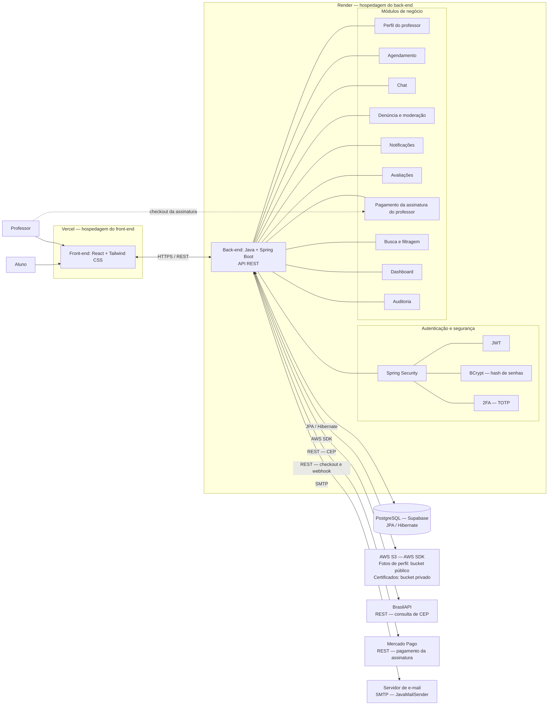

# Figura 1 — Diagrama de arquitetura

```mermaid
flowchart LR
    Professor[Professor]
    Aluno[Aluno]

    subgraph Vercel["Vercel — hospedagem do front-end"]
        FE["Front-end: React + Tailwind CSS"]
    end

    subgraph Render["Render — hospedagem do back-end"]
        API["Back-end: Java + Spring Boot\nAPI REST"]

        subgraph Seguranca["Autenticação e segurança"]
            Security["Spring Security"]
            JWT["JWT"]
            BCrypt["BCrypt — hash de senhas"]
            TOTP["2FA — TOTP"]
        end

        subgraph Negocio["Módulos de negócio"]
            Perfil["Perfil do professor"]
            Agendamento["Agendamento"]
            Chat["Chat"]
            Denuncia["Denúncia e moderação"]
            Notificacao["Notificações"]
            Avaliacao["Avaliações"]
            Pagamento["Pagamento da assinatura do professor"]
            Busca["Busca e filtragem"]
            Dashboard["Dashboard"]
            Auditoria["Auditoria"]
        end
    end

    PG[("PostgreSQL — Supabase\nJPA / Hibernate")]
    S3["AWS S3 — AWS SDK\nFotos de perfil: bucket público\nCertificados: bucket privado"]
    BrasilAPI["BrasilAPI\nREST — consulta de CEP"]
    MP["Mercado Pago\nREST — pagamento da assinatura"]
    SMTP["Servidor de e-mail\nSMTP — JavaMailSender"]

    Professor --> FE
    Aluno --> FE
    FE <-->|"HTTPS / REST"| API

    API --- Security
    Security --- JWT
    Security --- BCrypt
    Security --- TOTP

    API --- Perfil
    API --- Agendamento
    API --- Chat
    API --- Denuncia
    API --- Notificacao
    API --- Avaliacao
    API --- Pagamento
    API --- Busca
    API --- Dashboard
    API --- Auditoria

    API <-->|"JPA / Hibernate"| PG
    API <-->|"AWS SDK"| S3
    API <-->|"REST — CEP"| BrasilAPI
    API <-->|"REST — checkout e webhook"| MP
    API -->|"SMTP"| SMTP

    Professor -.->|"checkout da assinatura"| Pagamento
```
