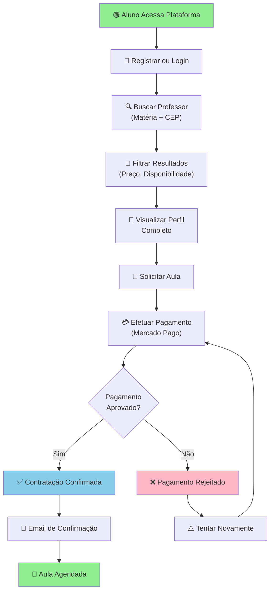
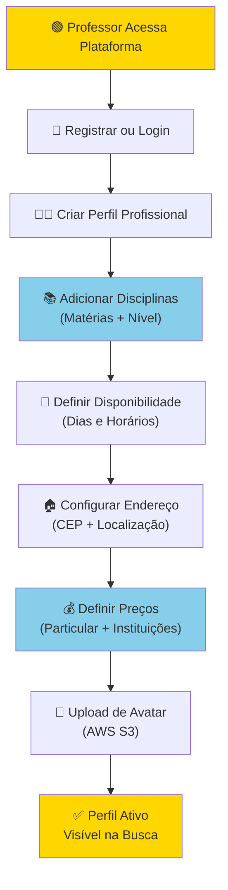
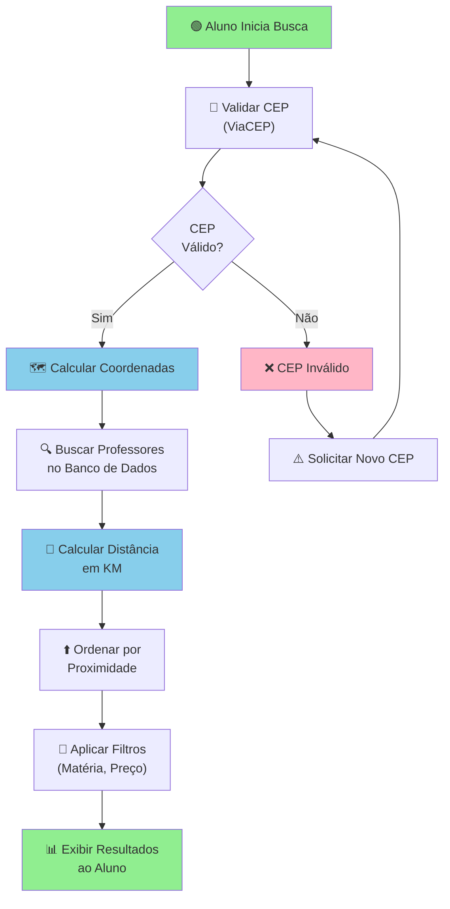
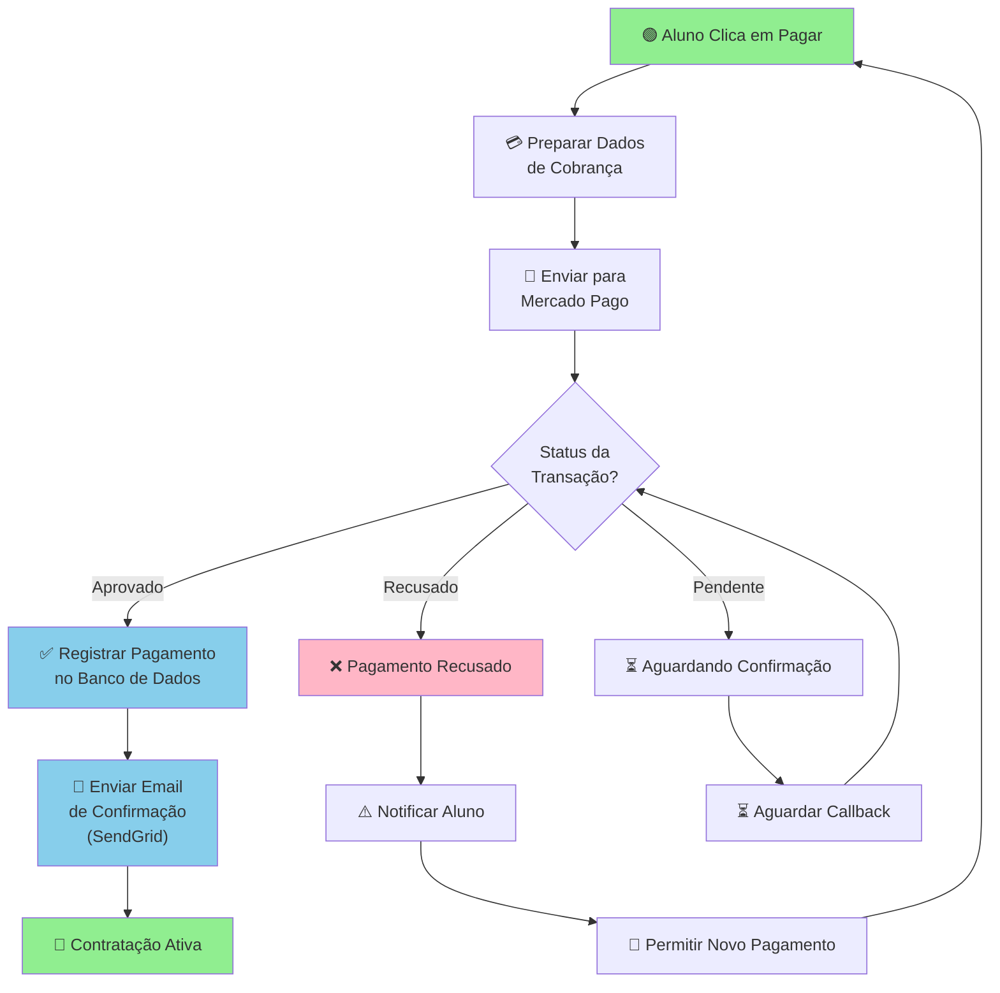
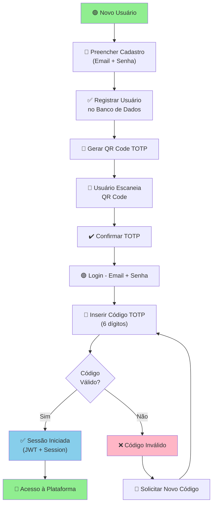
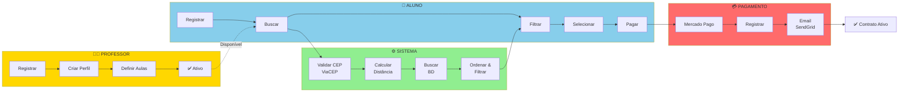
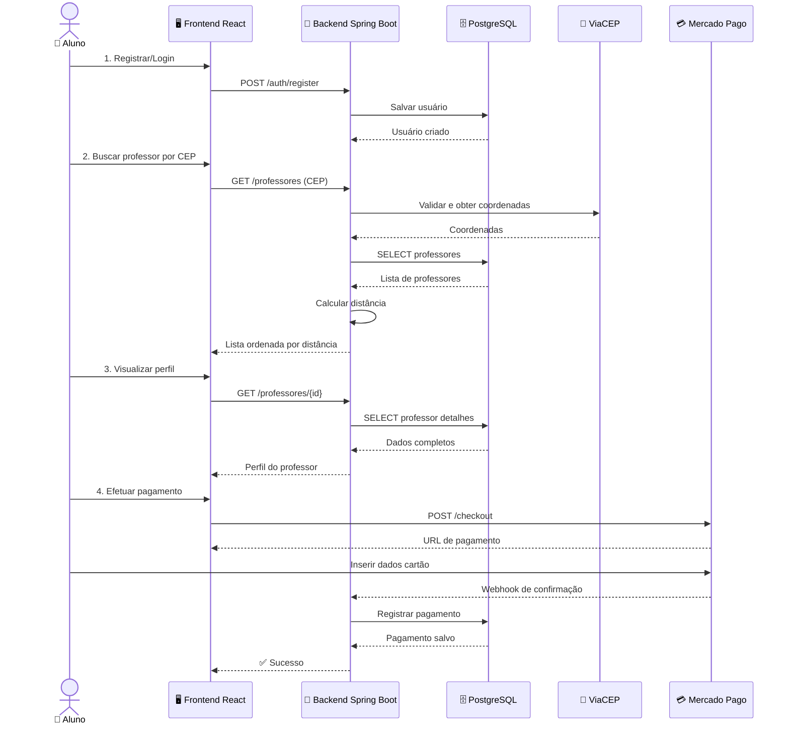
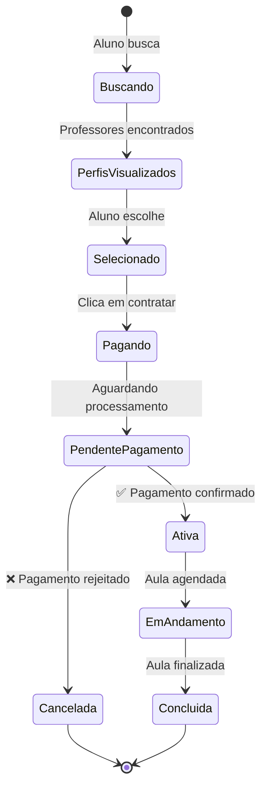

# 📊 Diagrama BPMN - Processos ConectaPro

## 1️⃣ Processo de Contratação (Aluno/Responsável)

---

## 2️⃣ Processo de Configuração de Perfil (Professor)

---

## 3️⃣ Processo de Busca e Filtro (Sistema)

---

## 4️⃣ Processo de Pagamento (Integração Mercado Pago)

---

## 5️⃣ Processo de Autenticação com 2FA (TOTP)

---

## 6️⃣ Processo Completo de Fluxo (Visão Geral)

---

## 7️⃣ Sequência de Interações (Detalhado)

---

## 📊 Matriz de Responsabilidades (RACI)

| Atividade | Aluno | Professor | Sistema | Mercado Pago | AWS S3 | ViaCEP | SendGrid |
|-----------|-------|-----------|---------|--------------|--------|--------|----------|
| Registrar | R | R | A | | | | |
| Criar Perfil | | R | A | | | | |
| Upload Avatar | | R | A | ✓ | | | |
| Buscar Professor | R | | A | | | | |
| Validar CEP | | | A | | | ✓ | |
| Calcular Distância | | | A | | | | |
| Pagar Assinatura | R | | A | ✓ | | | |
| Enviar Email | | | A | | | | ✓ |
| Auditoria | | | A | | | | |

**R = Responsável | A = Accountable | C = Consulta | I = Informado**

---

## 🔄 Estados Possíveis de Uma Contratação

---

## 🎯 Caso de Uso Principal

**Título:** Contratar Professor Particular

**Atores:** Aluno, Professor, Sistema ConectaPro

**Pré-condições:**
- Aluno registrado e autenticado
- Professor tem perfil completo e ativo
- Sistema tem conexão com ViaCEP e Mercado Pago

**Fluxo Principal:**
1. Aluno acessa a plataforma
2. Aluno busca professor por matéria e CEP
3. Sistema valida CEP com ViaCEP
4. Sistema calcula distância até cada professor
5. Sistema exibe professores ordenados por proximidade
6. Aluno visualiza detalhes do perfil
7. Aluno clica em "Contratar"
8. Aluno efetua pagamento via Mercado Pago
9. Sistema registra a contratação
10. Sistema envia email de confirmação via SendGrid
11. Aula é agendada

**Pós-condições:**
- Contratação ativa no sistema
- Emails enviados para aluno e professor
- Histórico registrado na auditoria

---

## 📝 Notas Técnicas

- **Autenticação:** JWT + Session + TOTP (2FA)
- **Autorização:** Role-based (PROFESSOR, ALUNO, ADMIN)
- **Auditoria:** Todas as ações críticas são registradas
- **Transações:** Uso de `@Transactional` para garantir consistência
- **Localização:** Cálculo de distância via Haversine formula
- **Segurança:** BCrypt para senhas, CORS habilitado, HTTPS obrigatório
