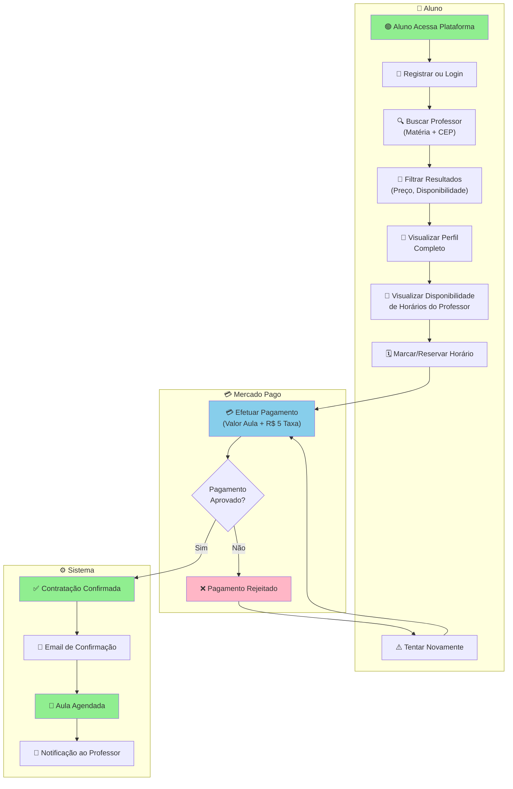
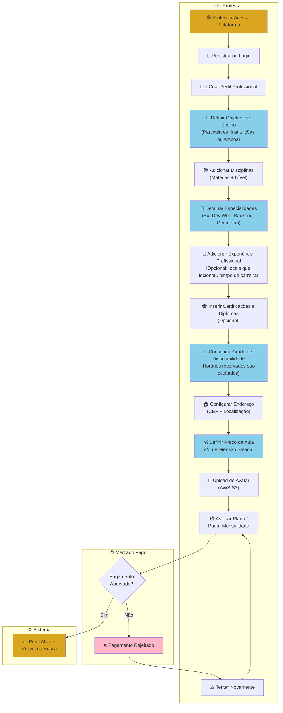
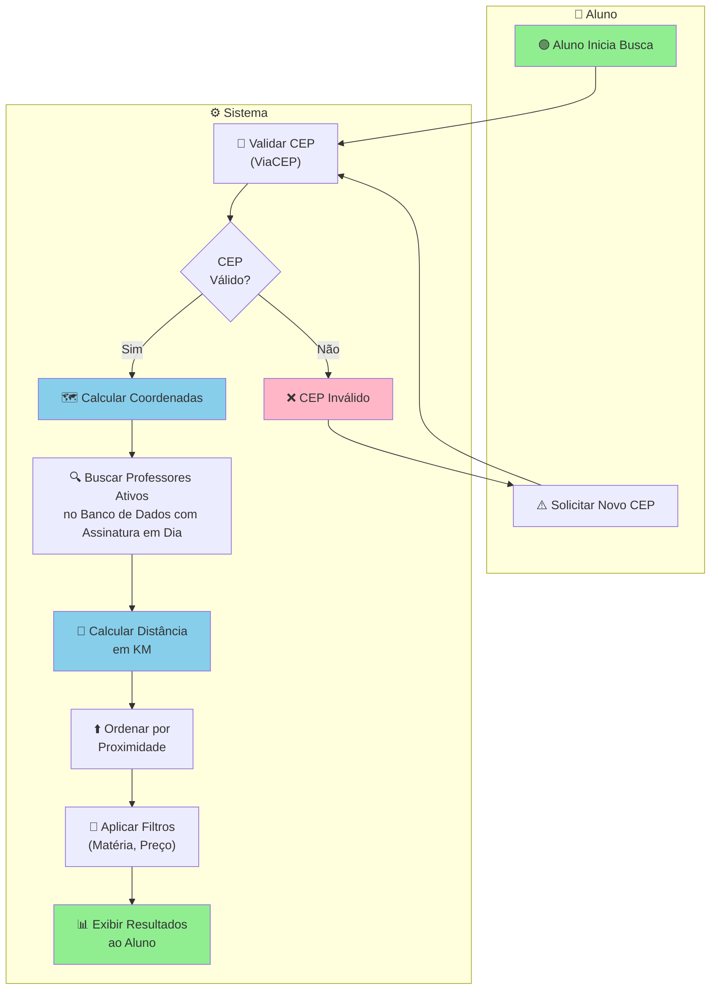
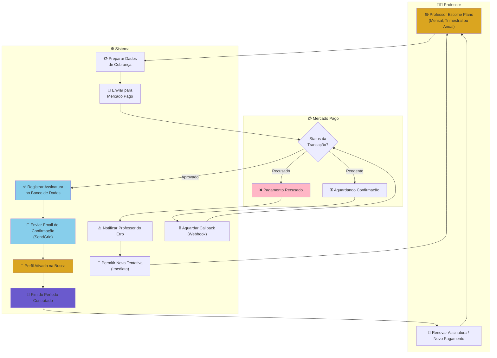
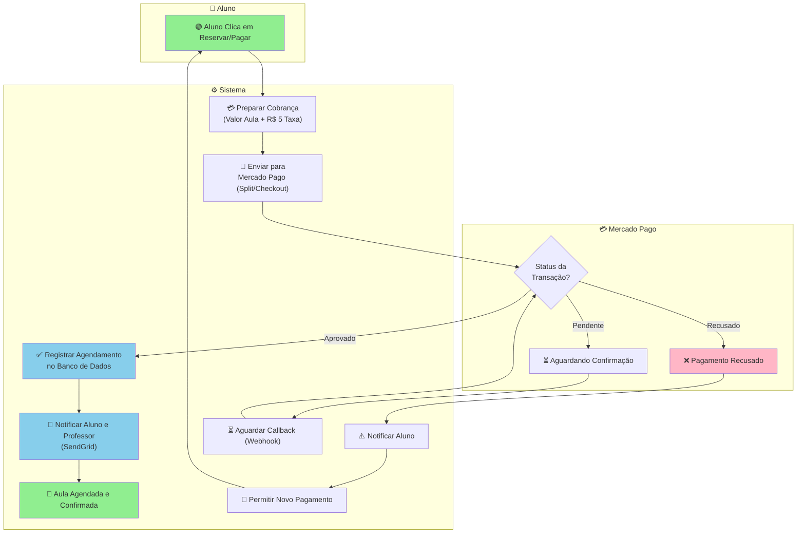
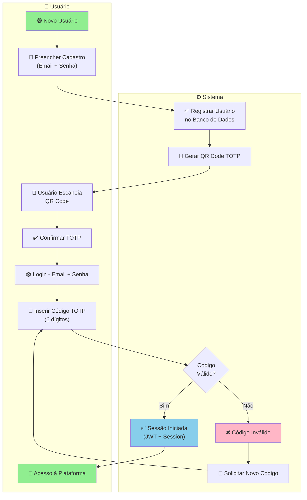
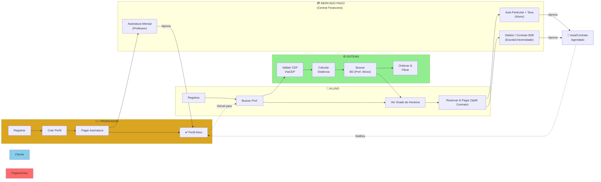
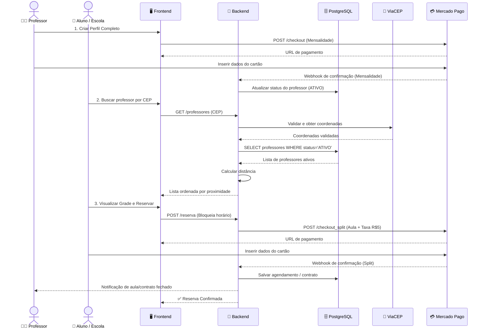
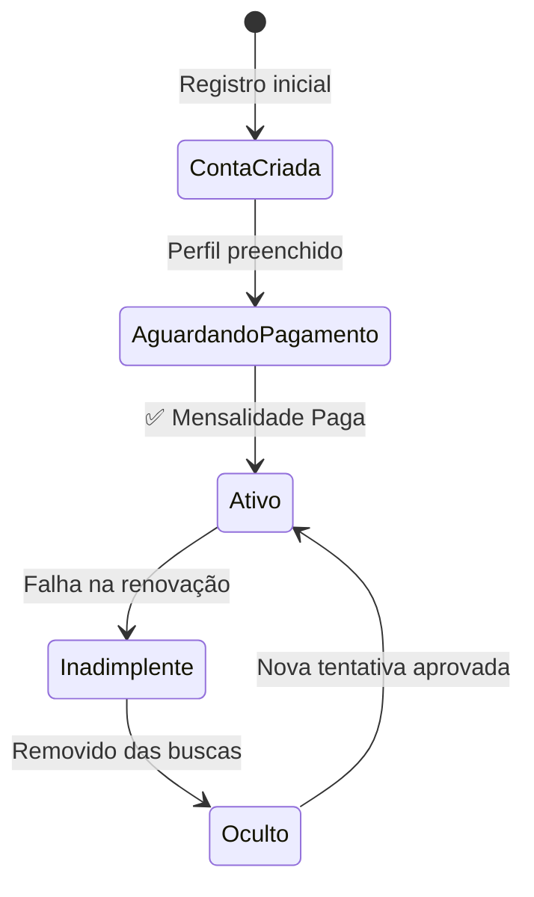
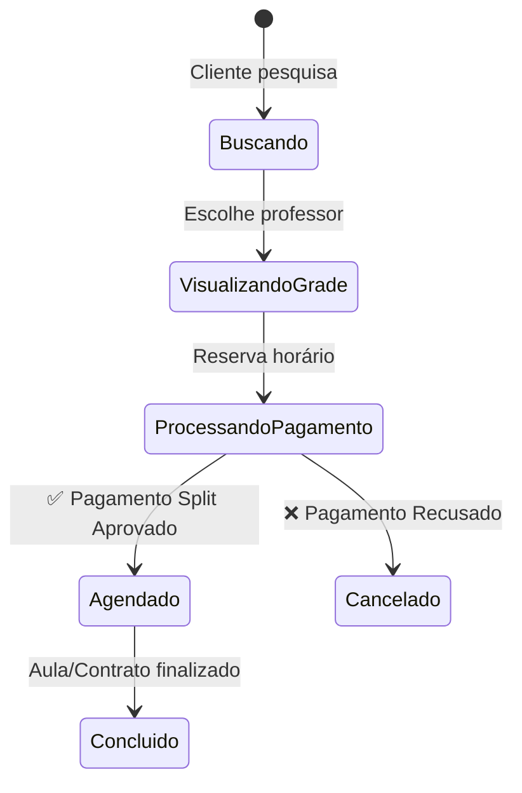

# 📊 Diagrama BPMN - Processos ConectaPro

## 1️⃣ Processo de Agendamento e Contratação (Aluno/Responsável)

_Responsável: Victor H C Sampaio - RGM 11231101604_

---

## 2️⃣ Processo de Configuração de Perfil e Assinatura (Professor)

_Responsável: Victor H C Sampaio - RGM 11231101604_

---

## 3️⃣ Processo de Busca e Filtro (Sistema)

_Responsável: Allan C D Guedes - RGM 11231103051_

---

## 4️⃣ Processo de Pagamento da Mensalidade (Integração Mercado Pago)

_Responsável: Henrique C M Costa - RGM 11222100629_

### 4.1 - Pagamento da Mensalidade (Professor)

---

### 4.2 - Pagamento do Agendamento de Aula (Aluno)

---

## 5️⃣ Processo de Autenticação com 2FA (TOTP)

_Responsável: Allan C D Guedes - RGM 11231103051_

---

## 6️⃣ Processo Completo de Fluxo (Visão Geral)

---

## 7️⃣ Sequência de Interações (Detalhado)

---

## 📊 Matriz de Responsabilidades (RACI)

| Atividade                      | Aluno/Escola | Professor | Sistema | Mercado Pago | AWS S3 | ViaCEP | SendGrid |
| ------------------------------ | ------------ | --------- | ------- | ------------ | ------ | ------ | -------- |
| Registrar Conta                | R            | R         | A       |              |        |        |          |
| Criar Perfil Completo          |              | R         | A       |              |        |        |          |
| Upload de Avatar/Certificados  |              | R         | A       |              | ✓      |        |          |
| Pagar Mensalidade (Assinatura) |              | R         | A       | ✓            |        |        |          |
| Buscar Professor por Filtros   | R            |           | A       |              |        |        |          |
| Validar CEP e Distância        |              |           | A       |              |        | ✓      |          |
| Reservar Horário na Grade      | R            |           | A       |              |        |        |          |
| Pagar Aula + Taxa (Split)      | R            |           | A       | ✓            |        |        |          |
| Enviar Emails/Notificações     |              |           | A       |              |        |        | ✓        |
| Auditoria de Transações        |              |           | A       |              |        |        |          |

**R = Responsável | A = Accountable (Aprovador) | C = Consultado | I = Informado**

---

## 🔄 Estados Possíveis no Sistema

### Status da Assinatura do Professor

### Status da Reserva de Aula (Aluno/Escola)

---

## 🎯 Caso de Uso Principal

**Título:** Contratar Professor (Aula Particular ou Instituição)

**Atores:** Aluno/Escola (Cliente), Professor, Sistema ConectaPro

**Pré-condições:**

- Cliente e Professor registrados e autenticados.
- Professor pagou a mensalidade e está com o status "ATIVO" (Visível na busca).
- Professor possui horários disponíveis em sua Grade.

**Fluxo Principal:**

1. Cliente acessa a plataforma e busca professor por matéria/CEP.
2. Sistema valida CEP (ViaCEP) e exibe professores ativos ordenados por proximidade.
3. Cliente acessa o perfil do professor, visualiza certificações e a grade de horários.
4. Cliente seleciona os horários desejados e clica em "Reservar e Pagar".
5. Sistema direciona para o checkout do Mercado Pago (com regra de Split).
6. Cliente efetua o pagamento (Valor do Professor + R$ 5,00 de Taxa da Plataforma).
7. Mercado Pago aprova a transação e repassa os valores correspondentes.
8. Sistema bloqueia o horário na grade do professor.
9. Sistema notifica (via SendGrid) ambas as partes sobre a confirmação da aula/contrato.

**Pós-condições:**

- Aula agendada ou contrato B2B firmado.
- Receita distribuída (Professor recebe o valor da hora/aula; Plataforma retém a taxa).
- Horários removidos da grade de disponibilidade pública do professor.

---

## 📝 Notas Técnicas

- **Autenticação:** JWT + Session + TOTP (2FA)
- **Autorização:** Role-based (PROFESSOR, ALUNO, ESCOLA, ADMIN)
- **Auditoria:** Todas as ações críticas (pagamentos, cadastros, reservas) são registradas.
- **Transações:** Uso de `@Transactional` para garantir consistência no banco de dados.
- **Localização:** Cálculo de distância via Haversine formula (PostGIS/GeoJSON recomendado para o futuro).
- **Segurança:** BCrypt para senhas, CORS habilitado, HTTPS obrigatório.
- **Pagamentos:** Integração com Mercado Pago via API de Checkout Pro com funcionalidade de Split de Pagamentos.
